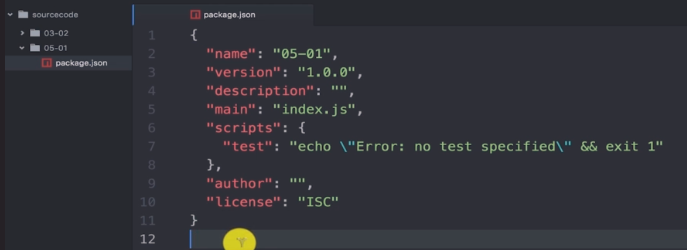
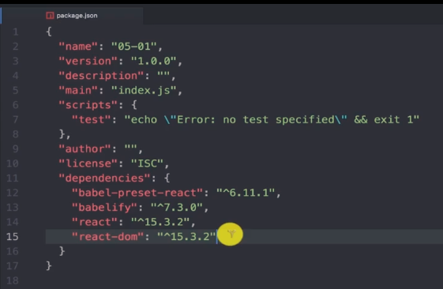
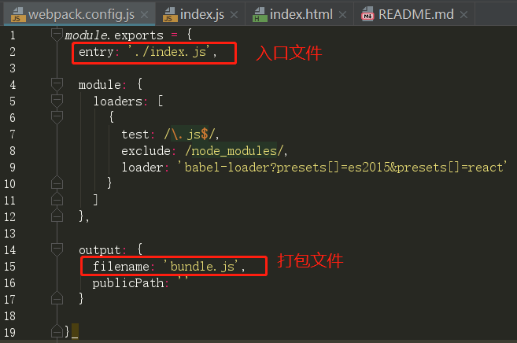
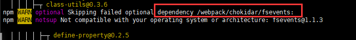

工具：node、npm、webpack
环境：linux
文件结构：
步骤：
1. **[创建本地代码]** 使用 `git clone [url]` 命令创建本地代码文件
2. **[npm项目初始化]** 进入到代码根目录，运行 `npm init` ，生成 `package.json` 配置文件
【注】：package.json文件相关参数可默认不填写

3. **[项目依赖包安装]** 使用 `npm install --save name1 name2` 或 `npm install name1 name2 --save` 命令安装其他必要组件。
如：react、react-dom、babel相关、......
`npm install --save react react-dom babelify babel-preset-react`

    附带 --save 参数安装完成后，这些包信息会被添加进 package.json 中，包文件放于 node_modules 文件夹下

4. 使用 webpack 打包
   1. 配置 `webpack.config.js`

   2. 安装 webpack （如以下包已安装过，也可重新安装，不受影响）
`npm install -g webpack`         # 此处需要全局安装

   3. 安装 webpack-dev-server （webpack开发服务器）
`npm install -g webpack-dev-server`

   4. 还要在项目的目录下安装一遍
`npm install webpack-dev-server --save`
`npm install webpack --save`
安装完成后，可查看到 `webpack.config.js` 中已出现相关参数

   5. 使用 webpack 命令打包
`webpack`          #回车，打包，将在指定目录中生成打包文件 bundle.js
`node_modules/.bin/webpack`       #当 webpack 未全局安装时使用该命令

5. ......

**【注】：存在的问题：**
  在上述配置打包过程中，可能会出现安装 webpack 及其服务后 webpack 命令还是无法使用的问题。

  1. 其中出现过的一个问题有：
    1.1 `npm install -g webpack` 后出现警告：

  原因是：

  因为该问题，也就导致后续的几步安装都会提示警告，导致使用 webpack 命令打包时系统提示
    ，`command not found`。
